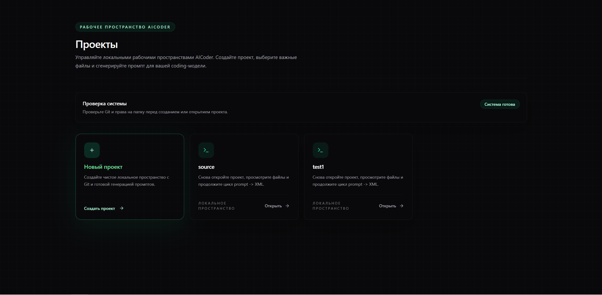
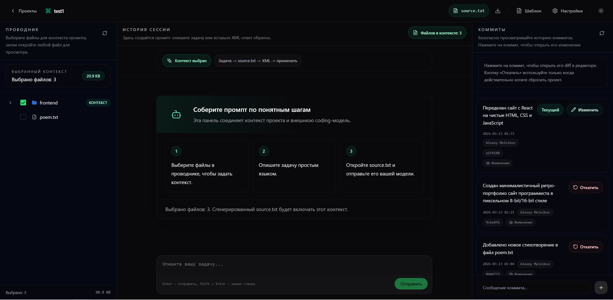

# shikumi

shikumi - локальный инструмент для работы с внешней coding-моделью по циклу `задача -> source.txt -> XML -> изменения в проекте`.

## Что делает shikumi

- выбирает файлы проекта как контекст;
- собирает `source.txt` для отправки в модель;
- принимает XML-ответ модели и применяет изменения к проекту;
- сохраняет историю изменений через Git.

## Скриншоты

### Экран проектов



### Рабочее пространство



## Главные команды

Установить backend-зависимости:

```powershell
cd source/backend_py
pip install -r requirements.txt
```

Собрать frontend:

```powershell
cd source/frontend
npm install
npm run build
```

Запустить приложение:

```powershell
cd C:\Users\acer\Desktop\aicoder
python source\backend_py\run_local.py
```

Проверить backend:

```powershell
cd source/backend_py
python manage.py test api
```

## Как пользоваться

1. Откройте приложение.
2. Создайте проект или откройте существующий.
3. Отметьте нужные файлы в левом проводнике.
4. Опишите задачу в центральной панели.
5. Откройте `source.txt` и отправьте его в модель.
6. Вставьте XML-ответ обратно в shikumi.
7. Проверьте изменения и историю коммитов справа.

## Стек

- Python / Django
- React / Vite
- Git

## Структура проекта

- `source/backend_py/` - backend
- `source/frontend/` - frontend
- `source/projects/` - пользовательские проекты
- `source/.aicoder/` - служебные файлы workspace

## Важно

- `source.txt` открывается внутри редактора приложения.
- Клик по коммиту справа открывает diff этого коммита.
- Кнопка `Откатить` делает жёсткий reset, используйте её осторожно.
