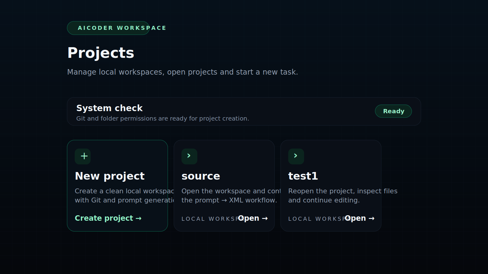
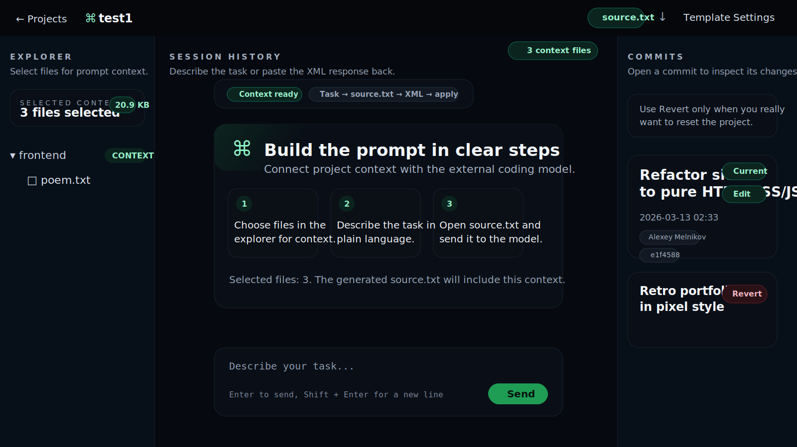

# AiCoder

AiCoder — локальный инструмент для работы с проектами через внешний LLM-сценарий.

Основной цикл работы:

1. выбрать файлы контекста;
2. описать задачу;
3. сгенерировать `source.txt`;
4. отправить его в модель;
5. вставить XML-ответ обратно в приложение;
6. применить изменения и сохранить их в Git.

## Скриншоты

### Экран проектов



### Рабочее пространство



## Возможности

- локальная работа с проектами без облачного backend;
- выбор файлов контекста перед генерацией prompt;
- генерация `source.txt` из задачи и выбранных файлов;
- применение XML-ответа модели к файлам проекта;
- история коммитов, просмотр diff по клику и откат;
- редактирование сообщения текущего коммита;
- готовый Windows-пакет для быстрого запуска обычным пользователем.

## Структура проекта

- `source/` — рабочая директория AiCoder
- `source/backend_py/` — Django backend
- `source/frontend/` — React/Vite frontend
- `source/projects/` — создаваемые проекты
- `source/.aicoder/` — служебные файлы текущего workspace
- `AiCoder_Windows_Package/` — готовая папка для передачи пользователю

## Требования

- Python 3.11+
- Node.js 20+ и npm
- Git

## Установка

### Backend

```powershell
cd C:\Users\acer\Desktop\aicoder\source\backend_py
python -m venv .venv
.venv\Scripts\Activate.ps1
pip install -r requirements.txt
```

Если виртуальное окружение не нужно:

```powershell
cd C:\Users\acer\Desktop\aicoder\source\backend_py
pip install -r requirements.txt
```

### Frontend

```powershell
cd C:\Users\acer\Desktop\aicoder\source\frontend
npm install
```

## Сборка фронтенда

```powershell
cd C:\Users\acer\Desktop\aicoder\source\frontend
npm run build
```

Backend ожидает production build в `source/frontend/dist`.

## Запуск

### Обычный локальный запуск

```powershell
cd C:\Users\acer\Desktop\aicoder
python source\backend_py\run_local.py
```

Без автоматического открытия браузера:

```powershell
cd C:\Users\acer\Desktop\aicoder
python source\backend_py\run_local.py --no-browser
```

С фиксированным портом:

```powershell
cd C:\Users\acer\Desktop\aicoder
python source\backend_py\run_local.py --port 9080 --no-browser
```

### Frontend в dev-режиме

В одном окне:

```powershell
cd C:\Users\acer\Desktop\aicoder\source\frontend
npm run dev
```

Во втором окне:

```powershell
cd C:\Users\acer\Desktop\aicoder
python source\backend_py\run_local.py --no-browser
```

## Проверка backend

```powershell
cd C:\Users\acer\Desktop\aicoder\source\backend_py
python manage.py check
python manage.py test api
```

## Как пользоваться

1. Откройте AiCoder.
2. Создайте новый проект или откройте существующий.
3. В левом проводнике отметьте файлы, которые нужно включить в контекст.
4. В центральной панели опишите задачу.
5. Откройте `source.txt` и отправьте его во внешнюю LLM.
6. Скопируйте XML-ответ модели.
7. Вставьте XML в поле ввода AiCoder и нажмите отправку.
8. Проверьте изменённые файлы и историю коммитов.

## Полезные файлы

- `source/.aicoder/source.txt` — сгенерированный prompt
- `source/prompt.md` — базовый шаблон prompt
- `source/settings.json` — базовые настройки workspace

## Windows-пакет для пользователя

В репозитории уже есть готовая папка:

- `AiCoder_Windows_Package/`

Внутри:

- `0_УСТАНОВИТЬ_PYTHON_И_GIT.bat`
- `БЫСТРЫЙ_СТАРТ.bat`
- `1_УСТАНОВИТЬ.bat`
- `2_ЗАПУСТИТЬ.bat`

Сценарий для обычного пользователя:

1. если Python и Git не установлены — открыть `0_УСТАНОВИТЬ_PYTHON_И_GIT.bat`;
2. затем открыть `БЫСТРЫЙ_СТАРТ.bat`.

## Примечания

- `source.txt` открывается внутри редактора приложения;
- клик по коммиту в правой панели открывает diff этого коммита в режиме только для чтения;
- сообщение текущего коммита можно редактировать через кнопку `Изменить`;
- кнопка `Откатить` делает `git reset --hard`, поэтому используйте её осторожно.
